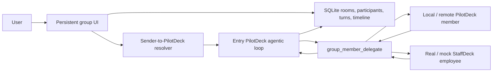

# PilotDeck group chat MVP

## Product behavior

PilotDeck now has a first-class **Groups** section beside Projects and General. A group is a durable, user-owned conversation with a visible member list and per-speaker timeline. It is different from rendering a collaboration call inside an ordinary one-to-one session.

Every group is bound to a PilotDeck project when it is created. That project path becomes the working directory for local PilotDeck participants and StaffDeck mock employees.

Two trigger modes are supported. The persisted `auto` value is retained for
backward compatibility, but its product label and behavior are now **Smart
coordination**:

- **Smart coordination (`auto`)**: every human message first enters the PilotDeck instance bound to that sender. The single-user MVP binds the owner to the room's main agent. The entry agent keeps its normal reasoning/tool loop and decides whether other members are needed instead of automatically polling the room. Explicit member mentions become ordered, required `group_member_delegate` calls; the main answer is held until those real calls have completed. `@所有人` requires every non-main member in configured order.
- **Mentions only**: the message text is always saved, but agents run only when it contains an exact, name-based mention token such as `@PilotDeck 评审员` or `@所有人`. `@所有人` follows the same member order and keeps the main agent last. Legacy `@member-id` text is still accepted by the server.

The composer renders mentions as atomic chips. The popup supports Up/Down selection, Enter confirmation, and Escape dismissal. A mention displays the member name, carries its stable id as structured metadata, and is deleted as one unit with Backspace/Delete.

The main session receives a private `group_member_delegate` tool plus the exact group roster. Natural-language messages use the same persistent PilotDeck gateway session and agentic loop as ordinary project/general conversations: the model may answer directly, use its normal reasoning and tools, or decide that one or more group members are needed. Each member response returns as a blocking tool result to the same main-agent turn, so the main agent can reassess the evidence, call a different employee, ask a necessary follow-up, or stop and synthesize. The UI never treats model-written `@name` text as proof of a call.

Delegation is deliberately main-agent-led rather than recursive. A delegated PilotDeck agent or StaffDeck employee cannot invoke another member; after its reply, control returns to the entry PilotDeck instance. A turn allows at most ten member calls and at most two calls to the same member, which preserves multi-employee planning while bounding accidental loops. Explicit mentions still take priority and must be completed in their visible order.

Group messages use a stable room sequence rather than timestamp rewrites. Reasoning, ordinary tool activity, delegation state, member replies, and the final main answer therefore survive refresh in the same visible order. Human participant bindings and per-turn entry-agent ownership are stored now so future multi-user rooms can route each person's message to that person's configured PilotDeck instance without handing control to the last AI speaker.

Mute is notification-only. A muted group continues all agent work, but suppresses browser push and the bright unread-count badge. Silent unread state is retained until the group is opened.

## Architecture



The UI polls durable group state while open. It shows compact, expandable reasoning/tool activity, a main-authored delegation card, a per-member typing placeholder, the member reply, and then the main continuation. Version 1 persists incremental state but still uses polling rather than token-level browser streaming.

## HTTP API

Authenticated routes are mounted under `/api/groups`:

- `GET /` and `POST /`: list or create groups.
- `GET /:groupId`, `PATCH /:groupId`, and `DELETE /:groupId`: read, configure, or archive a group.
- `GET /:groupId/messages` and `POST /:groupId/messages`: read the timeline or begin a round.
- `POST /:groupId/conversations/:conversationId/stop`: stop the active round and clear queued rounds in one conversation. The server aborts the PilotDeck gateway turn and propagates cancellation to an active StaffDeck Run.
- `POST /:groupId/delegate`: local gateway-only member delegation, authenticated with the existing gateway server token.
- `POST /:groupId/read`: clear visible and silent unread state.
- `GET /available-members`: discover every StaffDeck employee visible to the configured account or credential, including ownership/public metadata.
- `POST /:groupId/members`, `DELETE /:groupId/members/:memberId`, and `PUT /:groupId/member-order`: manage membership and order.

The server validates structured mention ids against the visible, name-based text and preserves the composer's mention order. Client-provided mention metadata cannot invoke a member that was not actually mentioned; it only disambiguates members that share a display name.

## Member categories and execution kinds

The active product exposes **PilotDeck instances** and real **digital employees**. Historical local/Mock kinds remain readable in old timelines but cannot be invited or executed again:

| Product category | Kind | Execution path | Notes |
| --- | --- | --- | --- |
| PilotDeck instance | `pilotdeck_main` | Local PilotDeck gateway | Created automatically, owner-bound smart-coordination entry, can delegate agentically |
| PilotDeck instance | `pilotdeck_remote` | `/v1/chat/completions` | Stable `X-Hermes-Session-Id`; optional dedicated token environment variable |
| Digital employee | `staffdeck` | StaffDeck Open API v1 | Creates/reuses one employee session, streams its public execution trace into the group timeline, and returns the durable Run result |

## Real StaffDeck configuration

完整的配置项、凭据优先级、安全要求和验证方法见 [`staffdeck-integration.md`](./staffdeck-integration.md)。

```bash
export STAFFDECK_BASE_URL=http://127.0.0.1:10087
export STAFFDECK_API_KEY=sd_live_your_key
```

API-key discovery follows the employee boundary encoded by StaffDeck itself. PilotDeck does not maintain a second employee allowlist.

For a StaffDeck account that can already use the desired gallery employees, PilotDeck can authenticate through the regular account without granting it an administrator role:

```bash
export STAFFDECK_BASE_URL=http://127.0.0.1:10087
export STAFFDECK_TENANT_ID=tenant_demo
export STAFFDECK_USERNAME=your_username
export STAFFDECK_PASSWORD=your_password
```

When `STAFFDECK_API_KEY` is absent, account credentials select the legacy account adapter. Its access token is cached in memory until shortly before expiry, and neither the password nor token is written into group messages. Account discovery uses `GET /api/enterprise/agents`, so ordinary members see exactly the private employees they own plus all gallery employees currently published to them. PilotDeck preserves creator, ownership/public status, role and expertise metadata in the invite list and group member configuration. Before the first chat turn with a public employee, PilotDeck calls `POST /api/chat/agents/{agent_id}/use` automatically.

`STAFFDECK_BASE_URL` may be either the service root or the complete `/api/v1` base. PilotDeck uses:

- `GET /api/v1/agents` for employee discovery.
- `POST /api/v1/agents/{agent_id}/sessions` for a stable group/employee session.
- `POST /api/v1/agents/{agent_id}/runs:stream` with idempotency keys for one employee turn, consuming public SSE planning, intent, task-frame, capability, knowledge, skill, loop, status, and output events while persisting every logical step into the group timeline.
- `POST /api/v1/runs/{run_id}:cancel` when the user stops a running group round after PilotDeck has received the stream's `X-Run-ID` header.
- `POST /api/v1/agents/{agent_id}/runs` plus `GET /api/v1/runs/{run_id}` and `/result` only as a compatibility fallback when the StaffDeck deployment does not expose streaming Runs.

The API key is read only from the PilotDeck process environment and is never serialized into group members or chat messages. `STAFFDECK_POLL_INTERVAL_MS` can override the default one-second status polling interval used only by the non-streaming fallback. Existing deployments that still set `STAFFDECK_TENANT_ID` and `STAFFDECK_API_TOKEN` continue to use the account-compatible adapter during migration.

When StaffDeck is not configured, the invite dialog reports the missing integration and does not synthesize local or Mock employees.

## Remote PilotDeck configuration

A remote member accepts a base URL or `/v1/chat/completions` URL. If authentication is needed, configure the secret in the PilotDeck process and store only its environment-variable name on the member:

```json
{
  "kind": "pilotdeck_remote",
  "name": "Remote Planner",
  "role": "delivery planning",
  "endpoint": "http://127.0.0.1:8642",
  "tokenEnv": "PILOTDECK_GROUP_REMOTE_PLANNER_API_KEY"
}
```

For safety, remote token variables must begin with `PILOTDECK_GROUP_`.

## Model-invoked collaboration tool

The existing `group_chat` built-in tool remains available to the main model for optional, session-scoped collaboration inside a normal conversation. It supports local/remote PilotDeck participants and real/mock StaffDeck employees. These transient tool rooms are deliberately separate from user-managed sidebar groups; they are orchestration scratch space and are cleared with the runtime.

Persistent group sessions never see that scratch-room tool. Only a persistent group's entry PilotDeck session sees `group_member_delegate`; secondary member sessions and ordinary sessions do not, preventing recursive or cross-room dispatch. Because each result is returned to the entry session's normal tool loop, the entry agent may make another StaffDeck call based on the previous employee's answer without turning employees into uncontrolled orchestrators.

## Remaining integration work

1. Add token-level browser streaming for PilotDeck and member reply text (public process steps are already streamed and persisted).
2. Define a versioned StaffDeck execution contract with capability metadata, service credentials, tracing, and idempotency.
3. Let the PilotDeck planner propose or reuse persistent groups while retaining explicit user control over membership and permissions.
4. Add cost/round budgets and richer autonomous convergence policies.
