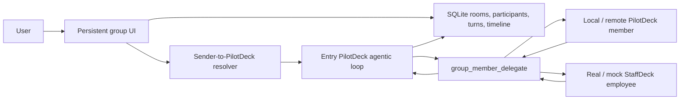

# PilotDeck group chat MVP

## Product behavior

PilotDeck now has a first-class **Groups** section beside Projects and General. A group is a durable, user-owned conversation with a visible member list and per-speaker timeline. It is different from rendering a collaboration call inside an ordinary one-to-one session.

Every group is bound to a PilotDeck project when it is created. That project path becomes the working directory for local PilotDeck participants and StaffDeck mock employees.

Two trigger modes are supported. The persisted `auto` value is retained for
backward compatibility, but its product label and behavior are now **Smart
coordination**:

- **Smart coordination (`auto`)**: every human message first enters the PilotDeck instance bound to that sender. The single-user MVP binds the owner to the room's main agent. The entry agent keeps its normal reasoning/tool loop and decides whether other members are needed instead of automatically polling the room. Explicit member mentions become ordered, required `group_member_delegate` calls; the main answer is held until those real calls have completed. `@所有人` requires every non-main member in configured order.
- **Mentions only**: the message text is always saved, but agents run only when it contains an exact, name-based mention token such as `@PilotDeck 评审员` or `@所有人`. `@所有人` follows the same member order and keeps the main agent last. Legacy `@member-id` text is still accepted by the server.

The composer renders mentions as atomic chips. The popup supports Up/Down selection, Enter confirmation, and Escape dismissal. A mention displays the member name, carries its stable id as structured metadata, and is deleted as one unit with Backspace/Delete.

The main session receives a private `group_member_delegate` tool plus the exact group roster. If the user naturally asks it to question or introduce a named member, it decides to call that member, saves a real delegation card and the member's response into the timeline, receives the response as a blocking tool result, and then continues the same agentic answer. The UI never treats model-written `@name` text as proof of a call.

Group messages use a stable room sequence rather than timestamp rewrites. Reasoning, ordinary tool activity, delegation state, member replies, and the final main answer therefore survive refresh in the same visible order. Human participant bindings and per-turn entry-agent ownership are stored now so future multi-user rooms can route each person's message to that person's configured PilotDeck instance without handing control to the last AI speaker.

Mute is notification-only. A muted group continues all agent work, but suppresses browser push and the bright unread-count badge. Silent unread state is retained until the group is opened.

## Architecture



The UI polls durable group state while open. It shows compact, expandable reasoning/tool activity, a main-authored delegation card, a per-member typing placeholder, the member reply, and then the main continuation. Version 1 persists incremental state but still uses polling rather than token-level browser streaming.

## HTTP API

Authenticated routes are mounted under `/api/groups`:

- `GET /` and `POST /`: list or create groups.
- `GET /:groupId`, `PATCH /:groupId`, and `DELETE /:groupId`: read, configure, or archive a group.
- `GET /:groupId/messages` and `POST /:groupId/messages`: read the timeline or begin a round.
- `POST /:groupId/delegate`: local gateway-only member delegation, authenticated with the existing gateway server token.
- `POST /:groupId/read`: clear visible and silent unread state.
- `GET /available-members`: discover local templates, StaffDeck employees, and mocks.
- `POST /:groupId/members`, `DELETE /:groupId/members/:memberId`, and `PUT /:groupId/member-order`: manage membership and order.

The server validates structured mention ids against the visible, name-based text and preserves the composer's mention order. Client-provided mention metadata cannot invoke a member that was not actually mentioned; it only disambiguates members that share a display name.

## Member categories and execution kinds

The product exposes three stable categories: **PilotDeck instance**, **agent**, and **digital employee**. Adapter kinds remain more specific implementation details:

| Product category | Kind | Execution path | Notes |
| --- | --- | --- | --- |
| PilotDeck instance | `pilotdeck_main` | Local PilotDeck gateway | Created automatically, owner-bound smart-coordination entry, can delegate agentically |
| Agent | `pilotdeck_local` | Local PilotDeck gateway | Stable session per group/member, bound project working directory |
| PilotDeck instance | `pilotdeck_remote` | `/v1/chat/completions` | Stable `X-Hermes-Session-Id`; optional dedicated token environment variable |
| Digital employee | `staffdeck` | StaffDeck `/api/chat/turn` | Selects one employee with `agent_id` and reuses its StaffDeck session |
| Digital employee | `staffdeck_mock` | Local PilotDeck gateway | Debug-compatible employee persona without StaffDeck data |

Local group participants run in PilotDeck `ask` mode in this MVP, so they can analyze the bound project without independently mutating it.

## Real StaffDeck configuration

```bash
export STAFFDECK_BASE_URL=http://127.0.0.1:5173
export STAFFDECK_TENANT_ID=your-tenant-id
export STAFFDECK_API_TOKEN=your-bearer-token
```

`STAFFDECK_API_TOKEN` is optional only when the deployment permits unauthenticated access. PilotDeck uses:

- `GET /api/chat/agents?tenant_id=...` for employee discovery.
- `POST /api/chat/turn` with `tenant_id`, `agent_id`, `message`, and `channel=pilotdeck_group_chat` for one employee turn.

When StaffDeck is not configured, the invite dialog still exposes researcher, engineer, and reviewer mock employees.

## Remote PilotDeck configuration

A remote member accepts a base URL or `/v1/chat/completions` URL. If authentication is needed, configure the secret in the PilotDeck process and store only its environment-variable name on the member:

```json
{
  "kind": "pilotdeck_remote",
  "name": "Remote Planner",
  "role": "delivery planning",
  "endpoint": "http://127.0.0.1:8642",
  "tokenEnv": "PILOTDECK_GROUP_REMOTE_PLANNER_API_KEY"
}
```

For safety, remote token variables must begin with `PILOTDECK_GROUP_`.

## Model-invoked collaboration tool

The existing `group_chat` built-in tool remains available to the main model for optional, session-scoped collaboration inside a normal conversation. It supports local/remote PilotDeck participants and real/mock StaffDeck employees. These transient tool rooms are deliberately separate from user-managed sidebar groups; they are orchestration scratch space and are cleared with the runtime.

Persistent group sessions never see that scratch-room tool. Only a persistent group's `main` session sees `group_member_delegate`; secondary member sessions and ordinary sessions do not, preventing recursive or cross-room dispatch.

## Remaining integration work

1. Add token-level per-speaker streaming and cancellation for a running group round.
2. Define a versioned StaffDeck execution contract with capability metadata, service credentials, tracing, and idempotency.
3. Let the PilotDeck planner propose or reuse persistent groups while retaining explicit user control over membership and permissions.
4. Add cost/round budgets and richer autonomous convergence policies.
