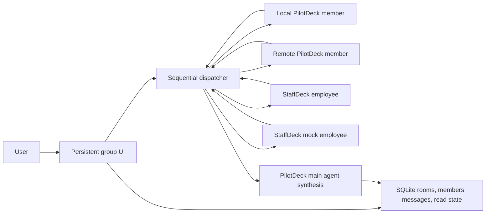

# PilotDeck group chat MVP

## Product behavior

PilotDeck now has a first-class **Groups** section beside Projects and General. A group is a durable, user-owned conversation with a visible member list and per-speaker timeline. It is different from rendering a collaboration call inside an ordinary one-to-one session.

Every group is bound to a PilotDeck project when it is created. That project path becomes the working directory for local PilotDeck participants and StaffDeck mock employees.

Two trigger modes are supported:

- **Automatic**: an unmentioned user message invokes all active members in configured order and the PilotDeck main agent runs last. Explicitly mentioning one or more concrete members overrides the all-member behavior and invokes only those members, still in configured group order. The main agent participates only when explicitly mentioned or when the message uses `@所有人` / `@all`.
- **Mentions only**: the message text is always saved, but agents run only when it contains an exact `@member-id` or `@所有人` / `@all`. `@所有人` follows the same member order and keeps the main agent last.

Mute is notification-only. A muted group continues all agent work, but suppresses browser push and the bright unread-count badge. Silent unread state is retained until the group is opened.

## Architecture



The UI polls group state while open and shows a per-member “typing” placeholder during sequential execution. Version 1 returns completed messages rather than token-level per-speaker streaming.

## HTTP API

Authenticated routes are mounted under `/api/groups`:

- `GET /` and `POST /`: list or create groups.
- `GET /:groupId`, `PATCH /:groupId`, and `DELETE /:groupId`: read, configure, or archive a group.
- `GET /:groupId/messages` and `POST /:groupId/messages`: read the timeline or begin a round.
- `POST /:groupId/read`: clear visible and silent unread state.
- `GET /available-members`: discover local templates, StaffDeck employees, and mocks.
- `POST /:groupId/members`, `DELETE /:groupId/members/:memberId`, and `PUT /:groupId/member-order`: manage membership and order.

The server derives mentions from saved message text. Client-provided mention metadata cannot invoke a member that was not actually mentioned.

## Participant kinds

| Kind | Execution path | Notes |
| --- | --- | --- |
| `pilotdeck_main` | Local PilotDeck gateway | Created automatically, fixed last, synthesizes the round |
| `pilotdeck_local` | Local PilotDeck gateway | Stable session per group/member, bound project working directory |
| `pilotdeck_remote` | `/v1/chat/completions` | Stable `X-Hermes-Session-Id`; optional dedicated token environment variable |
| `staffdeck` | StaffDeck `/api/chat/turn` | Selects one employee with `agent_id` and reuses its StaffDeck session |
| `staffdeck_mock` | Local PilotDeck gateway | Debug-compatible employee persona without StaffDeck data |

Local group participants run in PilotDeck `ask` mode in this MVP, so they can analyze the bound project without independently mutating it.

## Real StaffDeck configuration

```bash
export STAFFDECK_BASE_URL=http://127.0.0.1:5173
export STAFFDECK_TENANT_ID=your-tenant-id
export STAFFDECK_API_TOKEN=your-bearer-token
```

`STAFFDECK_API_TOKEN` is optional only when the deployment permits unauthenticated access. PilotDeck uses:

- `GET /api/chat/agents?tenant_id=...` for employee discovery.
- `POST /api/chat/turn` with `tenant_id`, `agent_id`, `message`, and `channel=pilotdeck_group_chat` for one employee turn.

When StaffDeck is not configured, the invite dialog still exposes researcher, engineer, and reviewer mock employees.

## Remote PilotDeck configuration

A remote member accepts a base URL or `/v1/chat/completions` URL. If authentication is needed, configure the secret in the PilotDeck process and store only its environment-variable name on the member:

```json
{
  "kind": "pilotdeck_remote",
  "name": "Remote Planner",
  "role": "delivery planning",
  "endpoint": "http://127.0.0.1:8642",
  "tokenEnv": "PILOTDECK_GROUP_REMOTE_PLANNER_API_KEY"
}
```

For safety, remote token variables must begin with `PILOTDECK_GROUP_`.

## Model-invoked collaboration tool

The existing `group_chat` built-in tool remains available to the main model for optional, session-scoped collaboration inside a normal conversation. It supports local/remote PilotDeck participants and real/mock StaffDeck employees. These transient tool rooms are deliberately separate from user-managed sidebar groups; they are orchestration scratch space and are cleared with the runtime.

## Remaining integration work

1. Add token-level per-speaker streaming and cancellation for a running group round.
2. Define a versioned StaffDeck execution contract with capability metadata, service credentials, tracing, and idempotency.
3. Let the PilotDeck planner propose or reuse persistent groups while retaining explicit user control over membership and permissions.
4. Add cost/round budgets and richer autonomous convergence policies.
