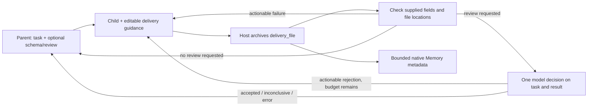

# Subtask delivery: say what was done, inspect what was delivered

A child finishing its model turn is not evidence that its promised file exists or its result satisfies the task. This change gives PilotDeck a small, explicit handoff: the child reports its work, the host checks applicable fields and archives the report, and the parent can request a bounded model review. Actionable failures return to the same child for local repair.

Developed from **面壁智能黑客松全场冠军成果**, as attributed by the contributor. [Engineering results](EXPERIMENTS.md) describe this implementation's actual evidence and limits independently of that provenance.

## Use it

1. Install dependencies with `pnpm install --frozen-lockfile` and build with `pnpm build`.
2. Start PilotDeck as usual (`pnpm dev` for the web development interface).
3. Open **Settings → Agents → Delivery**. Auto is the default; Off restores the original subagent execution path. Edit the example prompt and click **Save**. **Restore default** restores the built-in example when saved.
4. The parent may add `delivery.schema` for a particular subtask and `delivery.review: true` when content review is worth the cost. The reviewer defaults to the actual main conversation model; select an existing model in Settings to override it.
5. Expand a completed subtask's **Delivery checks** panel to inspect L1, L2, attempts, issues, model, tokens and its copyable receipt path. The same panel works after reopening the conversation. The parent receives `delivery_file` and can read that independent file directly.

```yaml
agent:
  delivery:
    mode: auto
    maxRepairs: 2       # at most three deliveries; shared total-turn budget also applies
    # reviewerModel: existing-provider/existing-model
    # prompt: ...      # optional; editable in the UI
```

Example parent `agent` call (ordinary task and description fields omitted here):

```json
{
  "delivery": {
    "review": true,
    "schema": {
      "type": "object",
      "properties": {
        "result": {
          "type": "object",
          "properties": {"file": {"type": "string"}}
        }
      }
    }
  }
}
```

The child can submit a task-specific JSON report, preferably through the Auto-only `structured_output` tool. Plain text is also archived. An illustrative report is:

```json
{
  "summary": "Added the parser and its documentation.",
  "inputs": [{"file": "docs/requirements.md"}],
  "changes": [{"file": "src/parser.ts", "locations": [{"startLine": 10, "endLine": 42}]}],
  "result": {"file": "docs/parser.md"}
}
```

This is **an example, not a required template**. For a text-only answer use `result.text`; the host still writes its own receipt, so a separate business file is unnecessary. For an image, video, PDF or PPT, report its file path. A custom layout can mark a result file with `{"role":"result","file":"..."}` anywhere. The reviewer can read bounded text excerpts only; it cannot verify rendered or audiovisual quality.

## The two stages



**L1:** meaningful supplied values only. It checks the limited schema's types/structure, declared file existence inside the workspace, and supplied line locations. Missing, null and recursively empty fields are skipped. `0` and `false` are meaningful. Unknown extra fields remain allowed. All-empty reports are skipped, not passed. A path-looking string is not guessed to be a file: use `{file: ...}` or a parent string schema with `x-file: true`. Deleted paths belong in descriptive fields such as `deleted_path`.

**L2:** only on the parent's request. A single tool-free call sees task, parent expectations, report and bounded explicitly selected result/code excerpts. It does not read the producer session or expand input/source documents. Insufficient or clipped evidence is inconclusive; errors never become acceptance. The Judge can still make a wrong semantic decision. It is useful additional review, not a correctness oracle.

Host archive keys and verdicts cannot be overwritten by child report keys. A successful L1 check proves only what was checked: it does not prove the child read a source, made a claimed edit, ran tests, used accurate sources, or completed the task. No answer keys, numerical answer constraints, required-field enforcement or workspace mutation auditing are added.

## Modules and limits

- `src/agent/sub/delivery/`: illustrative prompt, sparse checker, bounded receipt store, result packet, reviewer, same-session attempt orchestration.
- `SubAgentSession`, `AgentLoop` and `agent` tool: main/child model separation, parent choice, lifecycle and result handoff.
- Config/gateway/UI: Auto/Off, prompt save/restore, reviewer selection, budgets and persisted delivery cards.
- `DeliveryMemory`: bounded issue/attempt metadata in existing white-box Memory. No task/result bodies or private paths; skipped is not a learning success. No new Dream algorithm is introduced.

Receipts live at `.pilotdeck/deliveries/<subagent-id>/attempt-<n>.json` inside the task workspace. They can contain task results and should be treated like workspace files, not committed automatically. There is no retention cleaner in this change. Limits include 1 MiB receipts, two default repairs, 20 shared turns, a 4,096-token estimated review-input budget, 512 output tokens and a 60-second review timeout. Settings exposes these bounds. A pathological oversized report gets an explicit bounded failure receipt rather than silent acceptance. Native model routing, cancellation and permissions remain in force.

The reduced fallback `agent` executor can still archive/check an Auto result, but cannot guarantee same-session repairs or provide the native Judge; a requested unavailable reviewer returns an error. The full workflow uses PilotDeck's native gateway/subagent path.

## Evidence and demo

[Results and all completed runs](EXPERIMENTS.md) include unfavorable outcomes and evaluator corrections. Eight natural tasks do not show a general success lift. Four controlled faults demonstrate targeted interception and repair, and the natural Judge token ratio is 11.1% in aggregate, not a guaranteed ceiling.

[Minimal demo instructions](DEMO.md) cover a real local gateway run and an isolated web interface. Deliberate initial faults are labeled as demonstration fixtures; the child and Judge use real models. Do not count the demonstration as a natural success-rate experiment.

[Verification record](TESTING.md) lists builds, local tests, browser checks and the upstream network-test cancellations reproduced on the unchanged baseline.
