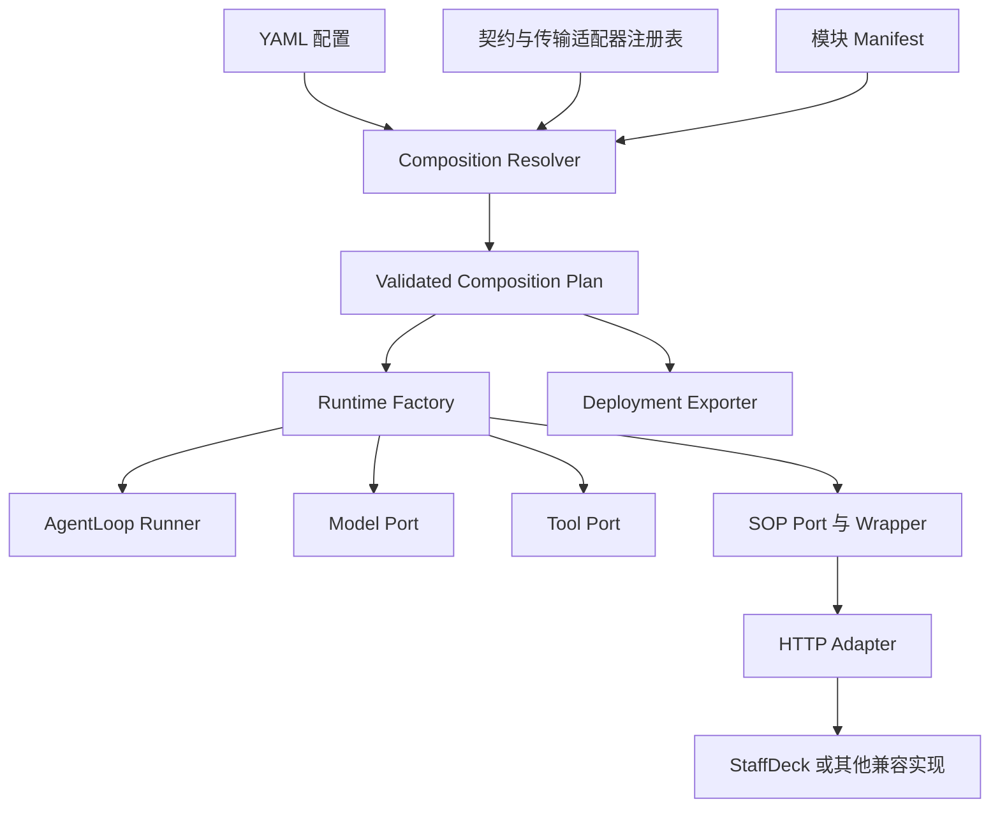

# 后端模块协议与可插拔装配设计

状态：设计提案，尚未实现。日期：2026-09-18。

本文基于 `codex/pilotdeck-staffdeck-sop` 和 `codex/portable-sop-runtime` 两个工作树的当前代码，包括未提交的 SOP glue 改动。本文不改变已有固定组合的验收范围，也不把新设计视为已验证能力。

## 1. 目标与边界

目标是：宿主不需要认识模块的作者、厂商或仓库，只要该实现满足宿主已支持的领域契约、传输协议和组合要求，就能通过 YAML 接入；导出器按配置产生对应部署。

“未知实现”可以零宿主代码接入；“未知模块类型”需要先定义宿主调用位置和领域契约。例如，新的 SOP 实现可以复用 SOP 插槽，而全新的 Planner 类型不能仅通过自报 manifest 自动成为 AgentLoop 的一个阶段。

本设计覆盖配置、契约、装配、RPC、状态归属、后端恢复和部署导出。不涉及前端、动态加载第三方 JavaScript、模块市场或任意生命周期 hook 系统。配置变更通过新建 runtime 或部署重启生效，不承诺活跃会话中的热替换。

所有变更限定在 composition、协议适配和打包层。PilotDeck AgentLoop 与 StaffDeck SOP owner 的业务语义继续由原模块负责。默认示例使用 `operator_approval`，不引入账户 onboarding、`lookup_account` 或子 SOP 执行能力。

## 2. 当前基础与差距

| 位置 | 当前实现 | 设计变化 |
| --- | --- | --- |
| `src/pilot/config/parseModulesConfig.ts` | 核心模块限 PilotDeck，SOP 限 StaffDeck | 解析实现描述，通过契约和 transport 选择适配器 |
| `src/cli/createLocalGateway.ts` | 根据 SOP 配置构造专用 wrapper | 消费已验证的 composition plan |
| `src/agent/loop/AgentLoopRuntimeFactory.ts` | 已有 runner 注入点 | 复用；外部 runner 仍受能力边界约束 |
| `src/agent/modules/protocol.ts` | Module Protocol v2、Model/Tool Port、流与回调协议 | 优先复用，不另建简化版通用 RPC |
| `src/sop/staffdeck/` | 客户端、上下文与工具 wrapper、宿主状态存储 | 分离协议级实现与 StaffDeck 兼容入口 |
| StaffDeck `portable_sop/.../original_runtime.py` | 调用原生 validator、graph、lifecycle | 保持 owner 委托；补充可选 manifest 描述 |
| `export-composition.mjs` | 按固定组合复制两个仓库 | 根据构建/镜像/外部端点声明生成部署 |

现有 `sop.lifecycle/v2` 是带 StaffDeck 数据约定的领域契约，不是所有工作流引擎天然兼容的格式。采用相同契约意味着接受现有 definition、state、step、proposal、result 及恢复语义；另一引擎需要在自己的 adapter 中实现这些约定。

## 3. 架构与装配边界



注册表登记的是宿主已经实现的 `(contract, transport)` 适配器，以及明确内置的实现。远端实现的 `implementationId` 仅用于识别和诊断，不参加厂商白名单判断。

同一种契约可以有多个实现，同一种实现也可以支持多个契约。一个选中的插槽只能绑定一个实现；当前 Tools 插槽视为一个完整工具集合，多工具提供者聚合属于后续独立能力。

职责划分：

| 层 | 负责内容 |
| --- | --- |
| Resolver | 配置结构、插槽基数、依赖、能力要求、组合限制 |
| Contract Adapter | payload 校验、协议到原生 Port 的映射、错误投影 |
| Transport | 连接、请求关联、取消、超时、流的传输 |
| Module Owner | 模型/工具/SOP/循环自身的执行语义 |
| PilotDeck Host | 会话、权限、transcript、持久化、恢复与装配生命周期 |
| Exporter | 来源收集、服务拓扑、配置重写、运行时依赖说明 |

## 4. 配置设计

保留顶层 `schemaVersion: 1`；新增的 binding 字段由 parser 显式识别。以下为拟议格式，当前代码不能直接使用。

```yaml
schemaVersion: 1
modules:
  agentLoop:
    enabled: true
    provider: pilotdeck
  modelProvider:
    enabled: true
    provider: pilotdeck
  tools:
    enabled: true
    provider: pilotdeck
  sop:
    enabled: true
    implementationId: acme.approval
    contract: sop.lifecycle/v2
    transport: sop-http-v2
    endpoint: http://sop-runtime:8091
    manifestPath: /healthz
    timeoutMs: 10000
    definitionsPath: ../sops/operator-approval.yaml
    defaultSopId: operator_approval
    requires:
      capabilities: [handoff]
    deployment:
      mode: image
      image: example/acme-sop:1.2.0
      port: 8091
```

- `provider: pilotdeck` 保留为内置实现简写。内置模块仍从已有 runtime bundle 装配。
- 新的外部 binding 使用 `implementationId + contract + transport`。禁止同时填写 `provider` 和新的实现选择字段，避免含义冲突。
- `implementationId` 标识配置中期望的实现；支持新 manifest 的服务必须与其匹配。任何合法字符串均可使用，无需宿主登记厂商。
- `contract` 决定领域数据与语义；`transport` 决定线上的消息和连接方式。两者都必须有宿主适配器。
- `endpoint` 为非托管运行时的实际地址；托管导出时由 exporter 改写为 Compose 服务地址。契约不由 URL 推断。
- `definitionsPath/defaultSopId` 是 `sop.lifecycle/v2` 的契约配置，不属于所有模块的通用配置。通用 parser 将它们交给契约 validator。
- SOP `enabled: false` 时不握手、不注入控制工具、不启动对应服务。三个核心插槽仍必需，不能关闭。
- `modelProvider` 指“模型调用模块的实现归属”；`agent.model` 和 `model.providers` 仍表示其使用的模型服务配置，二者不能混为一谈。

保留旧 `provider: staffdeck` 写法，由兼容解析器归一化为 `sop.lifecycle/v2 + sop-http-v2` 的 StaffDeck binding。现有 YAML 无需修改。`modules.sop` 缺省沿用关闭语义；现有无 modules 的配置继续使用 PilotDeck 默认运行时。

## 5. Manifest 与兼容性判断

SOP HTTP 保持 `GET /healthz`，以及原来的必需字段。新增字段采用独立的 `descriptorVersion`，不把描述文件版本与 RPC 版本混在一起。

```json
{
  "status": "ok",
  "protocolVersion": "2.0",
  "moduleId": "sop.runtime",
  "contract": "sop.lifecycle/v2",
  "operations": ["prepare", "submit"],
  "descriptorVersion": "1.0",
  "implementationId": "acme.approval",
  "implementationVersion": "1.2.0",
  "transport": "sop-http-v2",
  "capabilities": ["handoff", "external_wait"],
  "state": {
    "ownership": "host",
    "schema": "sop.lifecycle/v2",
    "scope": "session"
  },
  "requires": {
    "hostCapabilities": ["sop.host-resume/v1"]
  }
}
```

`moduleId: sop.runtime` 是契约角色，不是厂商 ID；不能直接将其改成 `acme-sop`。`implementationId` 才是实现身份。

启动按以下顺序判断：

1. 本地解析 YAML，确认 contract/transport 有适配器，检测必需插槽、依赖缺失和环路。
2. 按依赖顺序初始化连接，读取真实 manifest，校验结构和实现身份。
3. 精确匹配协议版本、契约、必需 operations、状态模式；第一版不做隐式版本降级或任意 semver 协商。
4. 校验配置所需 capabilities 是服务能力的子集，服务要求的 host capabilities 可满足。
5. 执行组合约束检查，例如 SOP wrapper 当前要求 native PilotDeck runner；单个模块握手成功不代表整个组合兼容。
6. 所有绑定成功后发布 runtime。任一步失败，释放本轮已创建资源，保留原 runtime 或拒绝新部署就绪。

旧 StaffDeck manifest 缺少 descriptor 字段时，只有旧 `provider: staffdeck` 兼容入口可以使用已知的 legacy 映射。新的未知实现必须提供新描述字段，不从名称猜测能力。manifest 成功结果按连接生命周期缓存，握手失败不能永久缓存；重连时重新验证身份和版本。

未知可选扩展字段可以忽略；未知必需能力、必需操作或状态模式必须拒绝。manifest 自报兼容只是准入信息，真正的行为兼容还需要契约测试。

## 6. 领域 Port 与传输协议

第一阶段只泛化 SOP，后续逐步开放已有核心模块 Port。下面的核心模块契约名是建议名，需在相应阶段发布 schema 后才成为可配置能力。

| 插槽 | 契约 | 宿主接口与要求 |
| --- | --- | --- |
| SOP | 已有 `sop.lifecycle/v2` | `prepare`、`submit`；宿主持有状态，模块返回状态转换结果 |
| Model Provider | 拟议 `pilotdeck.model/v1` | 复用 `ModelInvokerPort.prepare/stream` 与 CanonicalModelRequest/Event |
| Tools | 拟议 `pilotdeck.tools/v1` | 复用 `ToolPort.list/executeAll`；权限仍通过宿主授权 Port |
| AgentLoop | 拟议 `pilotdeck.agent-loop/v1` | 复用 AgentLoopRuntimeFactory、runner、seed 与已有 host callback 协议 |

SOP 使用 `sop-http-v2` 适配器，保留 `/v1/sop/prepare`、`/v1/sop/submit` 和原 envelope。路径中的 `/v1`、RPC `2.0`、StaffDeck 内部 harness v3 是不同层次的版本，迁移不要求它们数值一致。

Model/Tools/AgentLoop 复用 Module Protocol v2 的 execute、事件流、status/cancel/resume/ack 和 module_call 能力，但只开放当前适配器实际支持并通过测试的操作。SOP HTTP 与 Module Protocol v2 envelope 并不完全相同，不能用同一个 JSON 结构强行替换；由各自 transport adapter 映射到宿主 Port。

核心模块外置前必须处理已有接口的真实约束：

- `ToolPort.list()` 当前同步，远端工具目录需要启动时加载并冻结，不能直接改成 Promise 传给现有调用者。工具名冲突和保留 SOP 控制工具名冲突在装配时拒绝。
- Model `prepare` 的 `opaque` 不能直接序列化任意对象。远端 binding 应使用服务端句柄，并定义作用域、失效和清理行为。
- 流必须遵守原有事件顺序、终态、usage、tool-call 拼接和取消语义；不能把 streaming 简化成一次 HTTP JSON。
- 外部 AgentLoop 必须声明其需要的 model、tool、context、checkpoint 等 host callbacks；传输需支持请求期间的双向调用，单向 HTTP endpoint 不足以表达该契约。
- 工具执行位置必须明确。依赖宿主文件路径或工作区的工具，必须使用已支持的宿主回调/工作区绑定；普通远端服务不能假定本地路径可访问。不满足时装配拒绝。

第一版不强制所有模块实现 `initialize/dispose` 之类的远端操作。连接建立、握手与释放由宿主适配器负责；只有领域契约定义的远端生命周期才可调用。

## 7. Runtime 装配方案

建议新增 `src/composition/` 作为宿主装配层，放置 `types.ts`、`parse.ts`、`registry.ts`、`resolve.ts` 和部署计划类型。协议级 SOP 客户端与 wrapper 放入 provider-neutral 的 `src/sop/runtime/`；旧 `src/sop/staffdeck/` 保留兼容导出，逐步迁移调用者。

注册表示意：

```ts
registry.registerContract({
  contract: "sop.lifecycle/v2",
  transport: "sop-http-v2",
  validateConfig: validateSopConfig,
  validateManifest: validateSopManifest,
  createBinding: createHttpSopBinding,
});
```

注册表不需要 `registerProvider("acme")`。新的 acme 服务只要匹配已有契约，就走同一个客户端。

`resolve()` 分成离线解析与在线验证两步。离线阶段产生可导出的声明计划；在线握手后产生不可变的 validated runtime plan。导出时尚未运行的镜像不可能完成在线握手，导出成功不能被写成运行兼容已通过。

Gateway 消费 plan，构造 Model/Tool capabilities，再创建 runner，最后在受支持组合上装配 SOP wrapper。初始化前必须验证这一能力图可满足；资源失败时按创建的逆序清理。

继续使用 `AgentLoopRuntimeFactory` 和原有 runtime bundle。第一阶段保留 SOP 仅适配 native PilotDeck runner、主会话的限制。将来开放 SOP + 外部 loop，需要单独定义该 loop 可提供的上下文/工具装饰边界并验证组合，不能通过删掉现有 guard 宣称支持。

配置重新加载先构建候选 plan，失败时不得改变当前运行实例。模块选择、协议、端点或状态兼容性变化属于需要重建 runtime 的变更；活跃回合不得切换到另一 binding。

## 8. 状态、恢复与错误

SOP 契约限定为无业务副作用的转换服务：输入 definition、state、proposal 和工具成功凭据，返回新状态与结果。真实工具由 PilotDeck 执行；StaffDeck 原始 lifecycle 的状态投影由其 adapter 负责。

| 数据 | 持有者 | 约束 |
| --- | --- | --- |
| SOP definition 快照、slots、步骤、stack | PilotDeck 会话存储 | RPC 传快照，owner 决定合法转换 |
| revision、waitId、resume 请求记录 | PilotDeck | 防止旧 submission 或旧 wait 恢复推进新状态 |
| 工具执行记录与成功凭据 | PilotDeck | 不接受模型自报成功；每步消费与清理 |
| transcript 与回复 journal | PilotDeck | 保留现有持久回复恢复路径 |
| owner 临时对象 | 模块进程 | 可重建，不成为另一份权威会话状态 |

每次 `prepare/submit` 从同一会话快照发起，只有完整校验响应后，才以读取到的 revision 做条件提交。`expectedRevision` 的 wire 透传不能代替宿主本地的 revision fence。校验失败、网络失败或提交时版本冲突均不得修改本次 RPC 前的状态、wait 和 reply journal。

会话持久记录 binding 身份、contract、state schema 和 definition 快照。恢复时验证这些信息；替换 implementationId 或状态 schema 默认拒绝继续旧会话，要求新会话或显式迁移工具。相同协议不代表任意私有扩展状态可跨实现恢复。第一版不实现自动迁移。

后端 resume 保留现有两阶段语义：先按 waitId/revision 接受 human/external 结果，返回 continuation message，再经普通 PilotDeck turn 继续。外部 SOP 实现不直接调用模型、不代替宿主写 transcript。

错误分为装配错误与执行错误：

- 装配错误包括不支持的 contract/transport、缺失能力、依赖冲突、manifest 不兼容和未验证组合；在发布 runtime 前拒绝。
- 执行错误继续保留原始 SOP code、message、retryability、details，映射到已有工具错误体系的 `details.sopRuntime`。协议错误不作为业务失败重写。
- 保留 `completed/failed/cancelled/result_unknown` 区别；不能把未知结果转换成未发生或成功。
- SOP 无副作用请求的网络/超时可标记 `safe`，主动取消映射现有 `tool_aborted`；业务/协议拒绝为 `unsafe`，不引入自动重试。
- Tools 等有副作用操作超时，不能沿用 SOP 的 safe 策略。按契约查询 status；没有可靠查询结果时返回 `result_unknown`，不自动重放。

`idempotencyKey` 只表示传递了关联标识，不保证服务端持久去重。模块若声明 durable deduplication，必须同时定义作用域、保存期限、冲突与重启行为，并通过独立测试；第一阶段不要求该能力。

## 9. 导出与部署

导出器消费与 runtime 共用的离线配置/契约校验结果，避免目前 parser 与 exporter 各维护一套 provider 白名单。

`deployment.mode` 采用三种模式：

| mode | 配置 | 导出结果 |
| --- | --- | --- |
| `build` | `context`、`dockerfile`、`port` | 复制显式构建上下文到包内，生成相对 build 路径 |
| `image` | `image`、`port` | 生成指定镜像服务，无需理解该模块的源码仓库 |
| `external` | 原有 `endpoint` | 不生成该模块容器，在导出清单列出外部依赖 |

模块镜像/构建来源由 YAML 显式指定，不从远端 manifest 下载代码。未知实现提供镜像或构建上下文即可，exporter 不含其厂商专属分支。旧 StaffDeck 配置通过兼容层产生现有 build recipe。

托管服务名称由插槽确定，端口来自部署配置，健康检查由已支持的 transport recipe 生成。SOP 的 `manifestPath` 是受约束的路径，不允许模块提供任意 shell 健康检查命令。

导出目录建议为：

```text
deployment/
  compose.yaml
  config/pilotdeck.yaml
  modules/sop/                 # 仅 build 模式有构建上下文
  sops/definition.yaml
  pilotdeck/
  composition-record.json
  .env.example
  README.md
```

`composition-record.json` 记录配置选择、来源版本、镜像引用、构建配方、外部依赖以及在线验证是否执行，不记录凭据。它是交付清单，不是完整性校验文件。源码导出继续尊重当前工作树内容，交付记录应说明包含未提交改动。

关闭 SOP 时不复制其模块上下文、不创建服务、不生成运行依赖；仍使用完整 PilotDeck 主程序镜像，第一阶段不承诺按 TS 文件裁剪宿主镜像。

`external` 模式不能称为离线独立部署；`image` 模式仍依赖镜像可获取，`build` 模式仍可能依赖包仓库。自包含部署包表示不依赖原工作树，不等于离线包。外部模型服务也需列入依赖说明。

凭据继续通过环境引用在运行时注入。更换模块 binding 后必须重新执行启动握手；重启期间 endpoint 同名但服务身份发生变化也不能绕过验证。

## 10. 迁移顺序与完成条件

### 阶段 A：开放未知 SOP 实现

1. 提取并版本化现有 SOP payload/manifest schema 和契约说明，规定字段的必需、可选、null、扩展和状态语义。
2. 引入 composition parser/resolver；旧配置归一化，新配置按 contract/transport 装配。
3. 将 SOP HTTP client/wrapper 中实现选择的 StaffDeck 耦合移到兼容入口。既有错误字段、路径、owner 行为和宿主投影保持兼容。
4. 增加 identity/state/capability 验证与会话 binding 记录。旧会话通过明确的 legacy StaffDeck 映射读取，不能猜测为任意新实现。
5. exporter 支持 build/image/external，给出离线检查和在线验证的不同状态。
6. 用不导入 StaffDeck 的最小独立测试服务，验证“未知实现 + 同一契约 + 仅改 YAML”接入。该服务只实现有限测试定义，不能作为完整 SOP 语义等价证明。

完成标志：原有两个 profile 和旧会话恢复通过；未知 SOP 服务在没有厂商注册代码的情况下运行；不支持的契约与组合启动即拒绝；独立导出可从包内启动。

### 阶段 B：开放 Tools 与 Model Provider

分别发布基于现有 Port 的线协议 schema，解决工具目录快照、执行位置、权限、模型句柄、流顺序与恢复。每开放一种插槽，同时补它与 native PilotDeck loop、SOP wrapper 的组合测试。仅完成 SOP 不宣称整个核心模块矩阵可互换。

### 阶段 C：开放 AgentLoop 实现

复用现有 sidecar 握手与 host callbacks，列出 runner 对 context、model、tools、checkpoint 的依赖，验证中断、恢复、事件及持久化语义。外部 AgentLoop + SOP 作为独立组合门，未通过前明确拒绝。

新增 Memory/Planner 等类型另行定义插槽与领域契约。本设计不通过通用 hook 将未知语义自动接入主循环。

## 11. 后端验收矩阵

| 类别 | 必须验证的行为 |
| --- | --- |
| 旧配置兼容 | 原 StaffDeck YAML、SOP 关闭、无 modules 配置、现有会话恢复 |
| 未知实现 | 未在源码出现的 implementationId 通过契约接入；仅改 YAML 完成替换 |
| 准入拒绝 | 未知类型/契约/transport、错误身份、缺能力/operation、版本不匹配、非法组合 |
| 原子装配 | 中途握手失败释放已创建资源，不替换正在使用的 runtime |
| 响应边界 | 坏 payload、错 requestId、矛盾 envelope、合法 null 和扩展字段 |
| 状态并发 | prepare/submit 的 revision 冲突；坏响应不写状态；双恢复只接受一次 |
| 恢复与切换 | 同一 binding 重启恢复；更换身份/schema 拒绝旧会话；回复 journal 行为保留 |
| 真实 owner | StaffDeck 独立原生 oracle、portable tests 与现有 HTTP Gateway 回归 |
| 导出 | build/image/external 三种来源；SOP 关闭不生成服务；移开原工作树仍能构建/启动 |
| 后端 E2E | Gateway 发起 operator_approval，handoff，后端 resume，再发送 continuation 达到 completed |
| 核心扩展阶段 | 模型流/cancel、工具权限/副作用未知结果、loop host callbacks 及各受支持组合 |

测试 SDK 应允许模块作者在自己的服务地址上运行 contract conformance suite，检查 wire schema 和可观测语义。有限 conformance 通过表明满足对应场景，不能替代 provider 自身业务正确性验证。

本次设计文档不要求前端变更或重跑浏览器验收。后续实现阶段 A 时先运行受影响的协议、owner、Gateway 与部署测试；已有前端继续使用相同后端状态/resume 接口。

## 12. 代码参考

- 配置入口：[parseModulesConfig.ts](../../src/pilot/config/parseModulesConfig.ts)
- 装配入口：[createLocalGateway.ts](../../src/cli/createLocalGateway.ts)
- runner 注入点：[AgentLoopRuntimeFactory.ts](../../src/agent/loop/AgentLoopRuntimeFactory.ts)
- 既有模块协议与 Port：[protocol.ts](../../src/agent/modules/protocol.ts)
- SOP 协议：[types.ts](../../src/sop/staffdeck/types.ts)
- SOP 宿主装饰层：[SopAgentLoop.ts](../../src/sop/staffdeck/SopAgentLoop.ts)
- SOP 客户端：[StaffDeckSopClient.ts](../../src/sop/staffdeck/StaffDeckSopClient.ts)
- 导出入口：[export-composition.mjs](scripts/export-composition.mjs)
- StaffDeck 原生适配：另一工作树的 `portable_sop/src/staffdeck_sop_runtime/original_runtime.py`。
